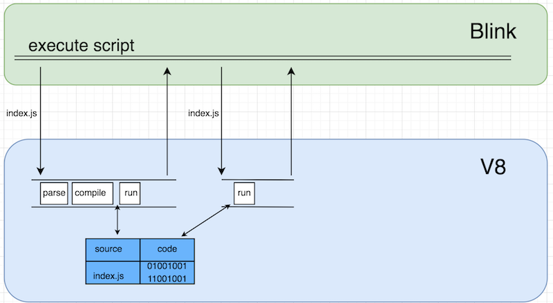
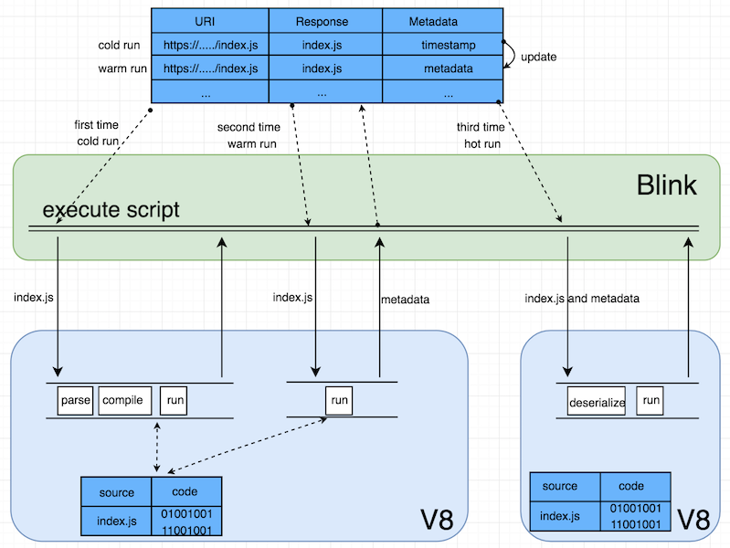

## 缓存的存储

Chrome 通过 code caching 将解析和编译的脚本的时间减少了 20% - 40%。这里我们看看Chrome是怎么缓存编译后数据的。

### In memory cache

V8 解析编译脚本以后，会以源代码：字节码这样的键值对存放在 V8 进程的堆内存中。第二次执行同样的脚本，V8 只需从内存中提取出来即可。

### On-desk cache

on-desk cache 通过将数据存放在硬盘中实现，同HTTP响应一样，但是同样的脚本至少需要命中两次才会缓存编译后的数据。

第一次请求会将响应缓存在硬盘中，且会带上时间戳。

第二次请求同样的脚本，若HTTP缓存未过期，则从缓存中获取脚本交给V8。若通过时间戳判断数据未超过72小时，则将编译后的字节码序列化后（下图的metadata）替换时间戳存储在硬盘中。若脚本过期，更新时间戳，并且此次请求算作第一次请求。

第三次以及之后的请求，若缓存未过期，则会直接从硬盘中获取序列化数据和脚本，交给V8，V8对其进行反序列化就能运行，而不需要从头解析编译。

以上的三次脚本执行分别称为 cold run，warm run 和 hot run。

V8 编译代码时为了加快速度，会将编译分为 top-level 编译和 lazy 编译。top-level编译关注即执行的代码，比如 IIFE，其他的都是 lazy 编译，这样可以避免编译暂时不需执行的代码，从而缩短时间。

### V8 字节码

额，本来想好好写一下。理解起来还是有点困难。以后再写吧。

资源如下：

V8 and How It Listens to You - Michael Stanton ：https://www.youtube.com/watch?v=u7zRSm8jzvA

JavaScript engines - how do they even? ：https://www.youtube.com/watch?v=p-iiEDtpy6I

Understanding V8’s Bytecode：https://medium.com/dailyjs/understanding-v8s-bytecode-317d46c94775

List:

https://v8.dev/blog/improved-code-caching