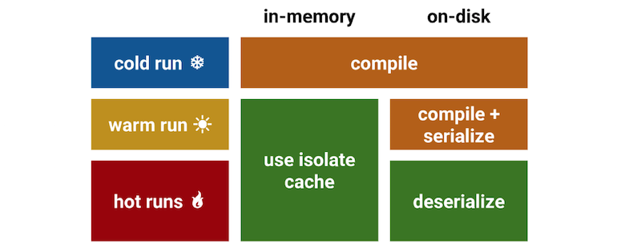

## Code Cache 简介

用户与浏览器的交互总是从加载页面开始的，我们将从加载到呈现的时间称之为白屏时间，在白屏时间内浏览器需要对资源进行加载，编译，运行，渲染等步骤。各个浏览器都在探寻缩短白屏时间的方式以给用户更好的体验。

### Why Code Cache

就JS而言，浏览器需要下载JS，解析编译成字节码，执行字节码，Chome引入了两种方式来减少此时间开销，一个是 Script Streaming，另一个是 Code Caching。今天我们来聊聊Code Caching。

V8 通过JIT执行代码，是指执行JS代码之前，需将其解析成AST，编译成字节码，然后再执行，这是个开销相当大的过程。如上图所示，解析和编译过程花费的时间超过了整个js执行花费时间的三分之一。由于编译代码高度依赖编译时机器的状态和上下文，所以一旦离开该页面，该编译代码即被丢弃，但是下次再遇到同样JS代码，又会重复该过程。因此V8选择将编译结果缓存起来，下次执行相同脚本时，即从缓存中读取，从而跳过编译解析过程，加快执行速度，减少计算开销。与此同时也增加了内存开销，所以浏览器会采取相应的策略来平衡这些。

###In-memory Cache

又称为 isolate cache，就是将编译过后的字节码以哈希表的形式存储在 V8 堆内存中，下次 V8 执行脚本时，会先在哈希表中查找一下，如果命中，则直接运行其字节码。据说命中率能达到 80%。

但是如果相同的脚本在另一个 V8 实例中，比如在另一个tab（另一个渲染进程）中，则该脚本仍然需要从头解析编译。Chrome 则通过 on-disk code cache 来弥补了此不足，on-disk code cache 可以在不同的进程，不同的 Chrome 会话中共享 code caches。

###On-disk Cache

on-disk code cache 是通过 Blink 来管理的，而 Blink 则利用 HTTP 缓存来管理缓存以及清除过期数据。

Blink第一次请求脚本，并给 V8 执行时，会将脚本存储在浏览器缓存中，这次称之为 cold run。

Blink 第二次请求脚本，如果该请求没有过期，直接从浏览器缓存中获取并交与 V8 执行。这次 Blink 会将序列化之后的脚本编译结果作为脚本元数据存储在浏览器缓存中，这次称之为 warm run。

Blink 第三次请求脚本时，请求没有过期，则直接从浏览器中获取脚本及其元数据交与 V8，V8 反序列化元数据则可以直接运行，不需要编译。这次称之为 hot run。

如下图所示，in-memory 和 on-disk cache共同作用，能够提高缓存的命中率，减少解析编译JS的时间，从而达到缩短白屏时间的目的。

### 结尾

我们可以在 Chome Dev Tools 上看到，哪些资源是 In-memory cache，哪些是 On-disk cache。

TODO:

In-memory cache 和 on-disk cache 的实现细节

如何跟踪调试

Js developer take action

V8 如何做到字节码与上下文无关

https://blog.chromium.org/2015/03/new-javascript-techniques-for-rapid.html

https://v8.dev/blog/code-caching

https://v8.dev/blog/code-caching-for-devs

https://v8.dev/blog/improved-code-caching

https://www.youtube.com/watch?v=YqHOUy2rYZ8

###资源：

[New JavaScript techniques for rapid page loads](https://blog.chromium.org/2015/03/new-javascript-techniques-for-rapid.html)

[Code caching](https://v8.dev/blog/code-caching)

[Code caching for JavaScript developers](https://v8.dev/blog/code-caching-for-devs)

[Improved code caching](https://v8.dev/blog/improved-code-caching)

[BlinkOn 9: Caching (more) JavaScript code in Chrome](https://www.youtube.com/watch?v=YqHOUy2rYZ8)

