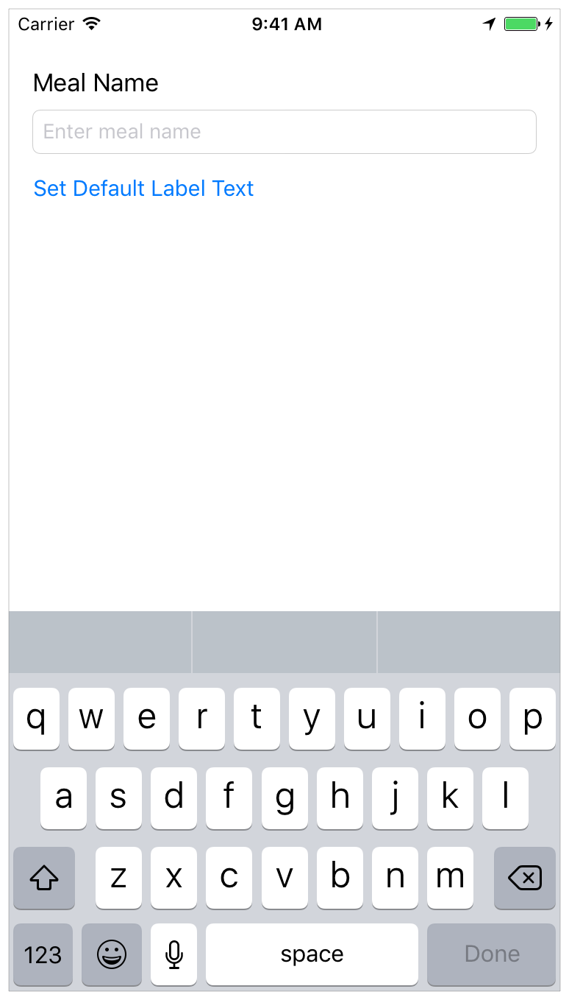

##Build a Basic UI
此课程让你熟悉Xcode（编写应用程序的工具）。熟悉Xcode中项目结的构，学习在基本的项目组件之间导航和使用。在本课程中，你将开始为FoodTracker创建一个简单的UI，并在模拟器中看到它。当你完成之后，应用程序应该看起来像这样：
>This lesson gets you familiar with Xcode, the tool you use to write apps. You’ll become familiar with the structure of a project in Xcode and learn how to navigate between and use basic project components. In the lesson, you’ll start making a simple user interface (UI) for the FoodTracker app and view it in the simulator. When you’re finished, your app will look something like this:

###Learning Objectives

当此课程结束时，你可以：

 - 在Xcode中创建一个项目
 - 确定一个用Xcode项目模版创建的密钥文件的目的？
 - 打开并在不同的项目文件中切换
 - 在iOS模拟器中运行一个应用程序
 - 在故事板中添加，移动，调整UI元素
 - 使用属性检查器编辑故事板中的UI元素的属性
 - 使用大纲视图查看和重排列UI元素
 - 使用辅助编辑器的预览模式预览故事板的UI
 - 使用自动布局去布局自适应用户设备尺寸的用户界面
 
>At the end of the lesson, you’ll be able to:
>
 - Create a project in Xcode
 - Identify the purpose of key files that are created with an Xcode project template
 - Open and switch between files in a project
 - Run an app in iOS Simulator
 - Add, move, and resize UI elements in a storyboard
 - Edit the attributes of UI elements in a storyboard using the Attributes inspector
 - View and rearrange UI elements using the outline view
 - Preview a storyboard UI using the Assistant editor’s Preview mode
 - Use Auto Layout to lay out a UI that automatically adapts to the user’s device size

###Create a New Project

Xcode有几个内置的应用程序模板，用于开发常见类型的iOS应用程序，例如游戏，基于标签的导航应用程序和基于表视图的应用程序。大多数这些模板具有预配置的接口和源代码文件。在本课中，你将从最基本的模板开始：Single View Application。
>Xcode includes several built-in app templates for developing common types of iOS apps, such as games, apps with tab-based navigation, and table view-based apps. Most of these templates have preconfigured interface and source code files. For this lesson, you’ll start with the most basic template: Single View Application.

